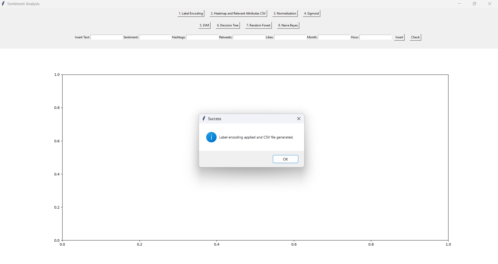

# Social Media Sentiment Analysis

## Overview
This project aims to analyze sentiment from social media posts using various machine learning models. It provides a user-friendly interface built with Tkinter for inputting text data and displaying sentiment results.


## Features
- **Machine Learning Models**: Supports multiple algorithms for sentiment analysis, including:
  - Support Vector Machine
  - Decision Tree
  - Random Forest
  - Naive Bayes
- **Data Preprocessing Techniques**:
  - Label Encoding
  - Normalization
  - Heatmap Visualization
- **User-Friendly GUI**

## Project Structure
```
.
├── Encoded_dataset/        # Folder containing encoded datasets
├── Heatmap/                # Folder for heatmap visualizations
├── Normalization/          # Folder for normalized datasets
├── Sentiment_dataset/      # Original sentiment datasets
├── Sigmoid_output/         # Output results from models
├── data_preprocessing.py    # Script for data preprocessing
├── models.py               # Script containing machine learning models
├── myapp.py                # Main application file with GUI
├── requirements.txt        # List of dependencies
└── utils.py                # Utility functions
```

## Installation
Follow the steps below to set up the project locally:

1. **Clone the Repository**:
   ```bash
   git clone https://github.com/piyush-ghanghav/social-media-sentiment-analysis.git
   cd social-media-sentiment-analysis
   ```

2. **Set Up a Virtual Environment** (optional but recommended):
   ```bash
   python -m venv venv
   ```

3. **Activate the Virtual Environment**:
   - **On Windows**:
     ```bash
     venv\Scripts\activate
     ```
   - **On macOS/Linux**:
     ```bash
     source venv/bin/activate
     ```

4. **Install Required Dependencies**:
   ```bash
   pip install -r requirements.txt
   ```

## Usage
1. **Run the Application**:
   ```bash
   python myapp.py
   ```

2. **Input Data**: 
   - Enter the social media text data in the provided input fields.
   - Select the desired machine learning model to analyze the sentiment.

3. **View Results**: 
   - The application will display the sentiment analysis results based on the selected model.


## Results Snapshots

Here are some snapshots of the results generated by the application:

### GUI


### Heatmap Visualization


### Label Encoding 


### Results 


## Acknowledgments
- **[Scikit-learn](https://scikit-learn.org/stable/)**: For implementing various machine learning algorithms.
- **[Tkinter](https://docs.python.org/3/library/tkinter.html)**: For providing the graphical user interface.
